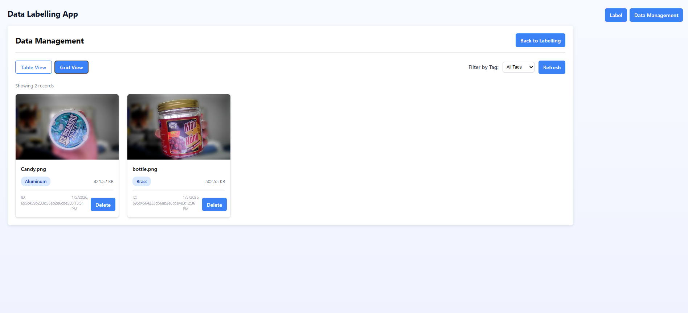
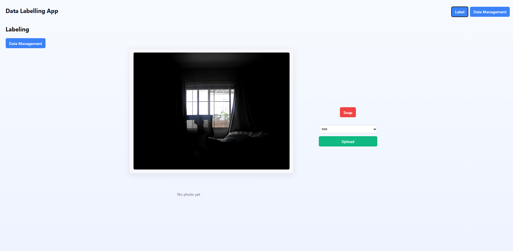
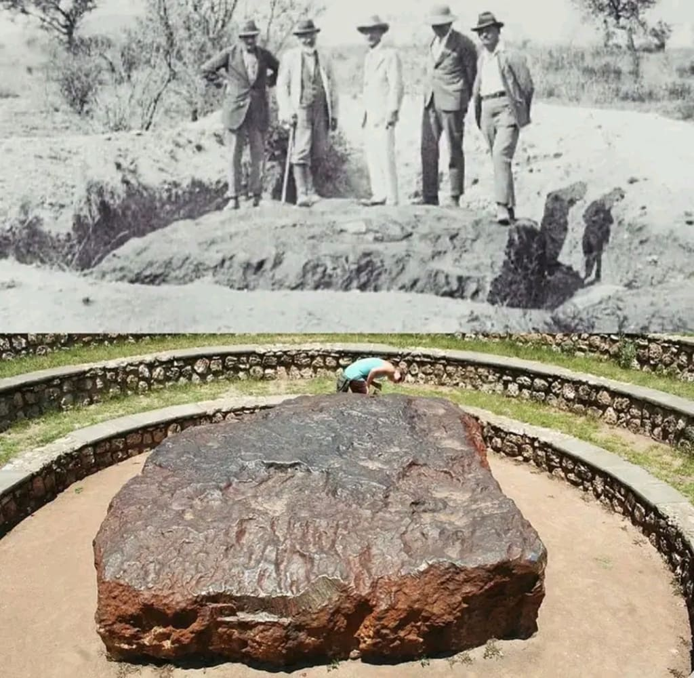
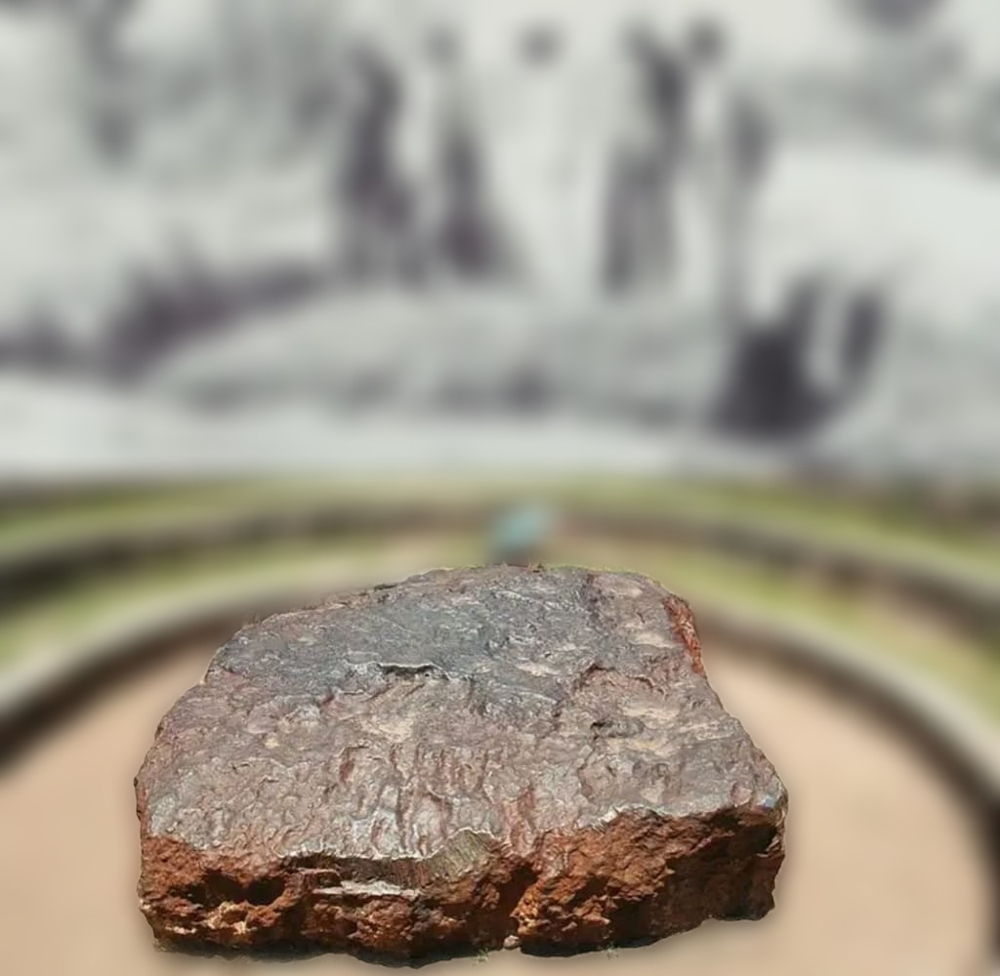

# Labelling Metal App

Lightweight web app for capturing, processing and managing images of metal samples. The project provides a React + Vite frontend and an Express/MongoDB backend that can blur image backgrounds, store labeled images, and let users manage uploaded assets.

---

## Features

- Capture photos from a device camera (mobile-friendly)
- Background-blur processing endpoint (server-side)
- Upload images with a user-provided filename (server ensures uniqueness by appending a counter if needed)
- Tagging / labeling images
- Data management UI with preview and click-to-zoom modal
- Delete images and metadata from the server

## Screenshots

**UI — Data Management**



**UI — Labeling / Capture**



**Result — Before**



**Result — After (background blurred)**



## Tech Stack

- Frontend: React + Vite
- Backend: Node.js, Express
- Storage: MongoDB (Mongoose models)
- File upload: Multer

## Libraries & Dependencies Used

Below are the main libraries and tools used throughout the project and their purpose.

- Frontend
  - `react` / `react-dom` — UI library used for the single-page application.
  - `vite` — development server and build tool for fast frontend iteration.
  - ESLint + related plugins — linting and code quality (devDependencies).

- Backend / Server
  - `express` — web framework for the API.
  - `multer` — handling multipart/form-data file uploads.
  - `mongoose` — MongoDB object modeling and schema definitions.
  - `cors` — Cross-Origin Resource Sharing middleware.
  - `dotenv` — load environment variables from `.env`.
  - `jsonwebtoken`, `bcrypt` — included for authentication/secure storage hooks (present in `server/package.json`).

- Image processing / Computer Vision
  - `sharp` — fast, native image processing used for compositing and blurring.
  - `@imgly/background-removal-node` — used in `server/utils/blurImage.js` to remove backgrounds (foreground mask).
  - (Project optionally supports integrating tools like `rembg` / U2-Net or SAM if you later want local ML-based segmentation.)

- Development / Tooling
  - `nodemon` — development server auto-restart for the backend (devDependency in `server`).

These libraries are referenced in `package.json` files or directly required from the server code (see `server/utils/blurImage.js` for image-processing dependencies).

## Repository Structure (important files)

- `server/` — Express API, image processing utilities, and MongoDB connection
- `src/` — React app (pages, components, assets)
- `uploads/` — stored images (created automatically by the server)
- `README.md` — this file

## Prerequisites

- Node.js (v16+ recommended)
- npm
- A running MongoDB instance (local or remote)

## Quick Start

1. Clone the repository

```bash
git clone <your-repo-url>
cd labelling_metal_app
```

2. Install frontend dependencies and start the dev server

```bash
npm install
npm run dev
```

3. Install server dependencies and start the backend (in a separate terminal)

```bash
cd server
npm install
npm run dev
# or use `node index.js` in production
```

4. Environment

Create a `.env` file in `server/` containing at least:

```
MONGO_URI=mongodb://127.0.0.1:27017/data_labeling
PORT=8000
```

The server will create the `uploads/` directory automatically when it runs.

## Client behavior: naming uploads

- When clicking `Upload` in the labeling page a small prompt asks for a filename.
- If you provide a name it will be sent to the server and used as the saved filename (the server sanitizes the name and appends `_1`, `_2`, ... when a collision occurs).
- If you leave the name blank, the original upload filename is used (or `capture.png` for camera captures).


## API Endpoints

- `POST /upload` — multipart/form-data
  - Fields: `file` (image), `tag` (optional), `filename` (optional), `blurRadius` (optional)
  - Returns JSON: `{ id, filename, originalname, tag, file_size, created_at }`

- `GET /tags` — returns available tags: `{ tags: [...] }`

- `GET /data` — returns list of uploaded items: `{ data: [...] }` (supports `?tag=...`)

- `GET /data/:id` — serves the image file for preview/download

- `DELETE /data/:id` — deletes the metadata document and the file from `uploads/`

- `POST /api/blur-background` — process and return blurred image (raw PNG)
- `POST /api/blur-background-base64` — same as above but returns base64 data URL

## Notes & Implementation Details

- Filenames are sanitized on the server (spaces replaced, unsafe chars removed) and made unique by appending a numeric suffix if necessary.
- The data listing endpoint returns the user-visible name as `originalname`; the saved file on disk is `filename` (the server response includes both).
- The frontend provides a modal zoom viewer — click any image in the Data Management page to open it and use the modal controls to zoom and close.

## Development Tips

- Change the backend port with `PORT` in `server/.env` if needed.
- If MongoDB is remote, set `MONGO_URI` to your connection string.
- To run the backend without `nodemon` use `node index.js`.

## Contributing

Contributions are welcome. Please open an issue or a pull request describing the change. Keep changes small and focused; update or add tests where appropriate.

## License

This project is available under the MIT License. Replace or adjust this section as needed for your preferred license.

---

If you'd like, I can also add a `CONTRIBUTING.md`, a license file, or format the README to include project badges and screenshots. Want me to add a sample `.env.example` too?
# Labelling Metal App

Lightweight web app for capturing, processing and managing images of metal samples. The project provides a React + Vite frontend and an Express/MongoDB backend that can blur image backgrounds, store labeled images, and let users manage uploaded assets.

---

## Features

- Capture photos from a device camera (mobile-friendly)
- Background-blur processing endpoint (server-side)
- Upload images with a user-provided filename (server ensures uniqueness by appending a counter if needed)
- Tagging / labeling images
- Data management UI with preview and click-to-zoom modal
- Delete images and metadata from the server

## Tech Stack

- Frontend: React + Vite
- Backend: Node.js, Express
- Storage: MongoDB (Mongoose models)
- File upload: Multer

## Libraries & Dependencies Used

Below are the main libraries and tools used throughout the project and their purpose.

- Frontend
  - `react` / `react-dom` — UI library used for the single-page application.
  - `vite` — development server and build tool for fast frontend iteration.
  - ESLint + related plugins — linting and code quality (devDependencies).

- Backend / Server
  - `express` — web framework for the API.
  - `multer` — handling multipart/form-data file uploads.
  - `mongoose` — MongoDB object modeling and schema definitions.
  - `cors` — Cross-Origin Resource Sharing middleware.
  - `dotenv` — load environment variables from `.env`.
  - `jsonwebtoken`, `bcrypt` — included for authentication/secure storage hooks (present in `server/package.json`).

- Image processing / Computer Vision
  - `sharp` — fast, native image processing used for compositing and blurring.
  - `@imgly/background-removal-node` — used in `server/utils/blurImage.js` to remove backgrounds (foreground mask).
  - (Project optionally supports integrating tools like `rembg` / U2-Net or SAM if you later want local ML-based segmentation.)

- Development / Tooling
  - `nodemon` — development server auto-restart for the backend (devDependency in `server`).

These libraries are referenced in `package.json` files or directly required from the server code (see `server/utils/blurImage.js` for image-processing dependencies).

## Repository Structure (important files)

- `server/` — Express API, image processing utilities, and MongoDB connection
- `src/` — React app (pages, components, assets)
- `uploads/` — stored images (created automatically by the server)
- `README.md` — this file

## Prerequisites

- Node.js (v16+ recommended)
- npm
- A running MongoDB instance (local or remote)

## Quick Start

1. Clone the repository

```bash
git clone <your-repo-url>
cd labelling_metal_app
```

2. Install frontend dependencies and start the dev server

```bash
npm install
npm run dev
```

3. Install server dependencies and start the backend (in a separate terminal)

```bash
cd server
npm install
npm run dev
# or use `node index.js` in production
```

4. Environment

Create a `.env` file in `server/` containing at least:

```
MONGO_URI=mongodb://127.0.0.1:27017/data_labeling
PORT=8000
```

The server will create the `uploads/` directory automatically when it runs.

## Client behavior: naming uploads

- When clicking `Upload` in the labeling page a small prompt asks for a filename.
- If you provide a name it will be sent to the server and used as the saved filename (the server sanitizes the name and appends `_1`, `_2`, ... when a collision occurs).
- If you leave the name blank, the original upload filename is used (or `capture.png` for camera captures).

## API Endpoints

- `POST /upload` — multipart/form-data
  - Fields: `file` (image), `tag` (optional), `filename` (optional), `blurRadius` (optional)
  - Returns JSON: `{ id, filename, originalname, tag, file_size, created_at }`

- `GET /tags` — returns available tags: `{ tags: [...] }`

- `GET /data` — returns list of uploaded items: `{ data: [...] }` (supports `?tag=...`)

- `GET /data/:id` — serves the image file for preview/download

- `DELETE /data/:id` — deletes the metadata document and the file from `uploads/`

- `POST /api/blur-background` — process and return blurred image (raw PNG)
- `POST /api/blur-background-base64` — same as above but returns base64 data URL

## Notes & Implementation Details

- Filenames are sanitized on the server (spaces replaced, unsafe chars removed) and made unique by appending a numeric suffix if necessary.
- The data listing endpoint returns the user-visible name as `originalname`; the saved file on disk is `filename` (the server response includes both).
- The frontend provides a modal zoom viewer — click any image in the Data Management page to open it and use the modal controls to zoom and close.

## Development Tips

- Change the backend port with `PORT` in `server/.env` if needed.
- If MongoDB is remote, set `MONGO_URI` to your connection string.
- To run the backend without `nodemon` use `node index.js`.

## Contributing

Contributions are welcome. Please open an issue or a pull request describing the change. Keep changes small and focused; update or add tests where appropriate.

## License

This project is available under the MIT License. Replace or adjust this section as needed for your preferred license.

---
